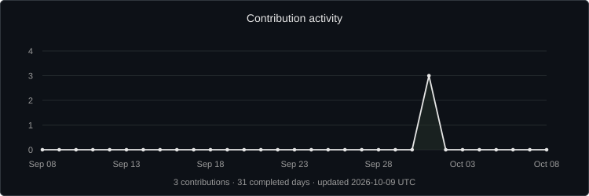

  

  
  <!-- TODO: DUEL_URL — wrap the DUEL badge in a link when the actual public URL is available. -->
  

---

<h3 align="center">About me</h3>

<table>
  <tr>
    <td width="70%" valign="middle">
      
Building things I find interesting.

      
Currently working on <strong>DUEL</strong> — a competitive skill-gaming platform.

      
Mostly experimenting with web development, product design and whatever I decide to build next.

    </td>
    <td width="30%" align="center" valign="middle">
      
    </td>
  </tr>
</table>

<h3 align="center">Technologies</h3>

  
  
  
  
   
  
  
  

---

<h3 align="center">Statistics</h3>

  

  

